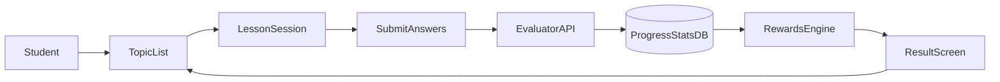

# Architecture

## Environments
- local: developer machine with dockerized PostgreSQL
- staging: preview environment for QA
- production: live environment

## Components
- `frontend`: Duolingo-like SPA on React + Vite
- `backend`: REST API on Express with rewards logic
- `database`: PostgreSQL 16

## Flow
1. Student authenticates in frontend.
2. Frontend loads topics and lessons.
3. Student starts lesson and sends selected answers.
4. Backend validates JWT and evaluates answers.
5. Backend stores attempts, updates progress, XP, streak, and achievements.
6. Frontend displays lesson result and updated motivation panel.

## Security baseline
- Passwords are hashed with bcrypt.
- Access token TTL is short.
- Refresh token is rotated.
- Protected endpoints require JWT middleware.

## Learning pipeline

